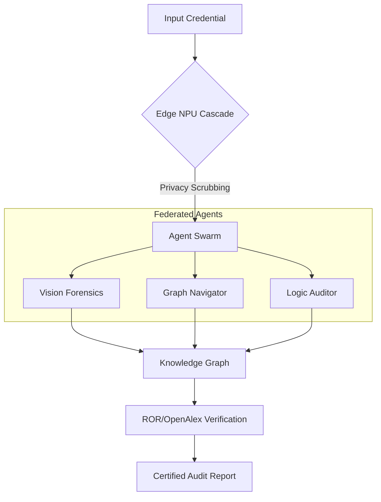

<div align="center">
  
  
  # 🛡️ Aegis-Graph
  ### Sovereign Academic Audit & Logical Verification Protocol
  
  [](https://atlanta-college-of-liberal-arts-and-sciences.gitbook.io/atlanta-college-of-liberal-arts-and-sciences/aegis-graph)
  [](https://aclascollege.github.io/aegis-graph/)
  [](LICENSE)
  
  **"Defending the Future of Education with Sovereign AI & Agentic Intelligence."**
</div>

---

### 🌐 Global Accessibility (Multi-language)

| 🌍 Region | Language Matrix |
| :--- | :--- |
| **Americas / EMEA** | [🇺🇸 English](README.md) • [🇫🇷 Français](i18n/README_FR.md) • [🇪🇸 Español](i18n/README_ES.md) • [🇩🇪 Deutsch](i18n/README_DE.md) • [🇵🇹 Português](i18n/README_PT.md) |
| **Asia Pacific** | [🇭🇰 繁體中文](i18n/README_ZH.md) • [🇯🇵 日本語](i18n/README_JP.md) • [🇰🇷 한국어](i18n/README_KR.md) |
| **Middle East** | [🇸🇦 العربية (RTL)](i18n/README_AR.md) |

---

## 🏛️ Project Manifesto

In the era of Generative AI, the barriers to creating high-fidelity fraudulent academic credentials have collapsed. **Aegis-Graph**, a flagship initiative of the [**Atlanta College of Liberal Arts and Sciences (ACLAS College)**](https://aclas.college/), is the first open-source response to this existential threat to academic meritocracy.

Aegis-Graph is not a mere OCR tool. It is a **Sovereign Multi-Agent Network** that combines **Agentic GraphRAG**, **Multimodal Forensics**, and **Verifiable Reasoning** to establish an immutable "Chain of Trust" for any academic document.

---

## 🚀 Technical Core: Agentic GraphRAG

Unlike traditional OCR verification, Aegis-Graph verifies **Logical Topology** through a 3-tier compute cascade.



### 🤖 The Agent Swarm Breakdown
- **Vision Forensics Agent**: Analyzes noise patterns, metadata consistency, and font-kerning anomalies to detect high-fidelity synthetic generation.
- **Graph Navigator Agent**: Executes multi-hop queries across OpenAlex (250M+ records) and ROR to verify institutional legitimacy and academic lineage.
- **Logic Auditor Agent**: Cross-references graduation timelines, course dependencies, and credit logic to detect internal semantic inconsistencies.

---

## 🔒 Security & Privacy by Design

Aegis-Graph implements a **"Sovereign Edge"** security model:
*   **PII Scrubbing**: Personally Identifiable Information is hashed or removed at the edge (NPU level) before graph traversal.
*   **Zero-Knowledge Proofs (Roadmap)**: Future integration of ZK-Snarks to verify "Attestation of Degree" without revealing transcripts.
*   **RAM-Only Execution**: Sensitive document parsing occurs in ephemeral memory, ensuring no persistent footprint of audited files.

---

## 🗺️ 2026-2027 Roadmap

- **Q3 2026**: Global Node Launch (EU & APAC Institutional Clusters).
- **Q4 2026**: Integration of ZK-Privacy Layer for non-disclosure attestations.
- **Q1 2027**: Aegis-Verify Mobile Wallet (Sovereign Credential Management).
- **Q2 2027**: Decentralized Governance (ACLAS Technical Committee DAO).

---

## 💼 Use Cases

| Industry | Implementation |
| :--- | :--- |
| **Higher Ed** | Automated screening of international applications with 99.9% fraud detection. |
| **Enterprise HR** | Instant verification of candidate credentials during onboarding. |
| **Gov/Sovereign** | National academic registry auditing and cross-border degree recognition. |

---

## 🛠️ Technical Stack

- **Core**: Python 3.11+, MCP (Model Context Protocol).
- **Intelligence**: Agentic Swarm (LLM/LVM Orchestration).
- **Graph Data**: OpenAlex API, ROR (Research Organization Registry).
- **Compute**: 3-Tier Cascade (NPU Edge -> Institutional Node -> Cloud).

---

## ⚙️ Configuration & Setup

```bash
# 1. Clone the node
git clone https://github.com/aclascollege/aegis-graph.git
cd aegis-graph

# 2. Environment Setup
# Create a .env file with your API keys:
# OPENALEX_API_KEY=your_key
# OPENAI_API_KEY=your_key (for reasoning agents)
pip install -r requirements.txt

# 3. Launch Audit
python main_pipeline.py --input examples/sample_transcript.pdf
```

---

## 🤝 Governance & Community

- **Contributing**: See [CONTRIBUTING.md](CONTRIBUTING.md)
- **Security**: See [SECURITY.md](SECURITY.md)
- **Code of Conduct**: See [CODE_OF_CONDUCT.md](CODE_OF_CONDUCT.md)

---

## 🌐 Connect & Support

<div align="center">
  <a href="https://x.com/aclascollege" target="_blank">
    
  </a>
  <a href="https://www.linkedin.com/school/aclas-college/" target="_blank">
    
  </a>
  <a href="https://aclas.college" target="_blank">
    
  </a>
  <a href="mailto:info@aclas.college">
    
  </a>
</div>

---

## 🧪 ACLAS Open-Source Ecosystem

| Project | Description | Link |
| :--- | :--- | :--- |
| **Aegis-Graph** | Sovereign Academic Audit Protocol | [View →](https://github.com/aclascollege/aegis-graph) |
| **Neuro-Edu** | AI-Powered Educational Sandbox | [View →](https://github.com/aclascollege/neuro-edu) |

---

<div align="center">
  <p>© 2026 Atlanta College of Liberal Arts and Sciences (ACLAS College). All Rights Reserved.</p>
  <p>Building the next generation of Sovereign Academic Intelligence.</p>
</div>
