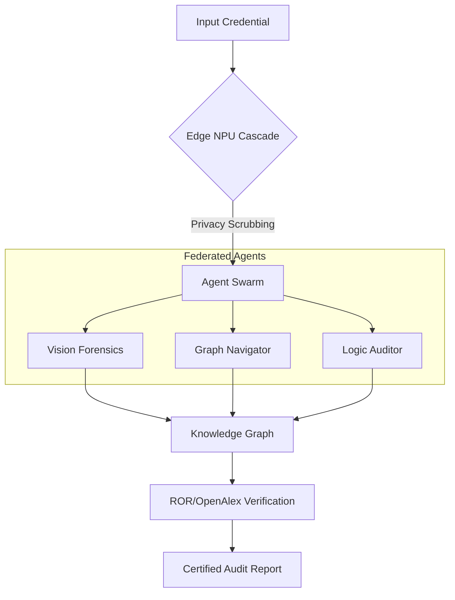

<div align="center">
  
  
  # 🛡️ Aegis-Graph
  ### Sovereign Academic Audit & Logical Verification Protocol
  
  [](https://atlanta-college-of-liberal-arts-and-sciences.gitbook.io/atlanta-college-of-liberal-arts-and-sciences/aegis-graph)
  [](https://aclascollege.github.io/aegis-graph/)
  [](LICENSE)
  
  **"Defending the Future of Education with Sovereign AI & Agentic Intelligence."**
</div>

---

### 🌐 Global Accessibility (Multi-language)

| 🌍 Region | Language Matrix |
| :--- | :--- |
| **Americas / EMEA** | [🇺🇸 English](README.md) • [🇫🇷 Français](i18n/README_FR.md) • [🇪🇸 Español](i18n/README_ES.md) • [🇩🇪 Deutsch](i18n/README_DE.md) • [🇵🇹 Português](i18n/README_PT.md) |
| **Asia Pacific** | [🇭🇰 繁體中文](i18n/README_ZH.md) • [🇯🇵 日本語](i18n/README_JP.md) • [🇰🇷 한국어](i18n/README_KR.md) |
| **Middle East** | [🇸🇦 العربية (RTL)](i18n/README_AR.md) |

---

## 🏛️ Project Manifesto

In the era of Generative AI, the barriers to creating high-fidelity fraudulent academic credentials have collapsed. **Aegis-Graph**, a flagship initiative of the [**Atlanta College of Liberal Arts and Sciences (ACLAS College)**](https://aclas.college/), is the first open-source response to this existential threat to academic meritocracy.

Aegis-Graph is not a mere OCR tool. It is a **Sovereign Multi-Agent Network** that combines **Agentic GraphRAG**, **Multimodal Forensics**, and **Verifiable Reasoning** to establish an immutable "Chain of Trust" for any academic document.

---

## 🚀 Technical Core: Agentic GraphRAG

Unlike traditional OCR verification, Aegis-Graph verifies **Logical Topology** through a 3-tier compute cascade.



---

## 🌟 Key Innovations

- **3-Tier Compute Cascade**: 85% reduction in token costs through edge-to-cloud load balancing.
- **Agentic Multi-Hop Reasoning**: Verification across 250M+ academic records (OpenAlex/ROR).
- **Zero-Knowledge Privacy**: PII data never leaves the institutional edge (NPU-based logic).
- **Sovereign Autonomy**: No reliance on third-party verification monopolies.

---

## 🛠️ Quick Start

```bash
# Clone the sovereign node
git clone https://github.com/aclascollege/aegis-graph.git

# Install institutional dependencies
pip install -r requirements.txt

# Launch the Verification Dashboard
# Open dashboard/index.html in any modern browser
```

---

## 🤝 Governance & Community

- **Contributing**: See [CONTRIBUTING.md](CONTRIBUTING.md)
- **Security**: See [SECURITY.md](SECURITY.md)
- **Code of Conduct**: See [CODE_OF_CONDUCT.md](CODE_OF_CONDUCT.md)

---

## 🌐 Connect & Support

<div align="center">
  <a href="https://x.com/aclascollege" target="_blank">
    
  </a>
  <a href="https://www.linkedin.com/school/aclas-college/" target="_blank">
    
  </a>
  <a href="https://aclas.college" target="_blank">
    
  </a>
  <a href="mailto:info@aclas.college">
    
  </a>
</div>

<br>

<div align="center">
  <p>© 2026 Atlanta College of Liberal Arts and Sciences (ACLAS College). All Rights Reserved.</p>
  <p>Building the next generation of Sovereign Academic Intelligence.</p>
</div>
