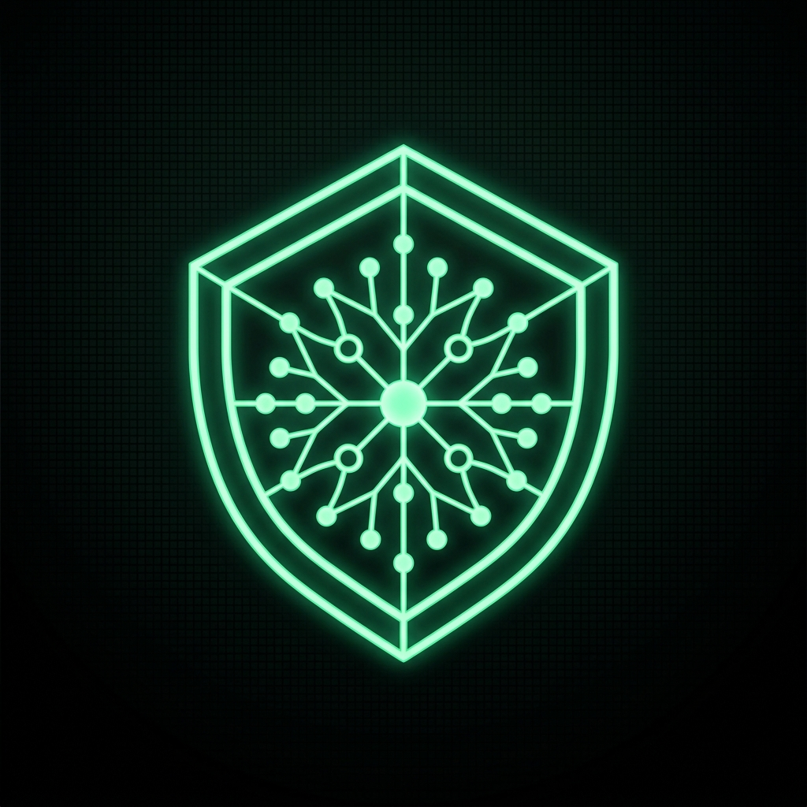

<div align="center">
  
  
  <br>

  [](https://aclas.college)

  # 🛡️ Aegis-Graph
  ### **The Sovereign Academic Audit Protocol**
  *Empowering Global Education with Agentic AI & Decentralized Graph Integrity*

  <p align="center">
    <a href="https://aclascollege.github.io/aegis-graph/"><b>Live Dashboard</b></a> •
    <a href="https://docs.aclas.college/aegis-graph"><b>Documentation</b></a> •
    <a href="WHITEPAPER.md"><b>Whitepaper</b></a> •
    <a href="https://aclas.college"><b>Institutional Site</b></a>
  </p>

  <div>
    
    
    
  </div>
</div>

---

## 🏛️ Executive Vision

**Aegis-Graph** is a decentralized framework specifically engineered to safeguard academic integrity in the age of generative AI. Developed by the **Atlanta College of Liberal Arts and Sciences (ACLAS)**, it replaces manual inspection with **Sovereign Reasoning Chains** powered by **Agentic GraphRAG**.

> "In an era of synthetic data, truth must be sovereign." — ACLAS Sovereign Node Group.

---

## 🧠 The Agentic Architecture

Aegis-Graph operates via a collaborative swarm of specialized AI agents:

<table>
  <tr>
    <td width="33%" align="center">
      <br><b>👁️ Vision Forensics</b><br>
      <p>Pixel-level analysis to detect AI-generated artifacts in digital credentials.</p>
    </td>
    <td width="33%" align="center">
      <br><b>🗺️ Graph Navigator</b><br>
      <p>Real-time traversal across 102,482 global ROR institutional nodes.</p>
    </td>
    <td width="33%" align="center">
      <br><b>⚖️ Logic Auditor</b><br>
      <p>Logical paradox detection using Chain-of-Thought reasoning.</p>
    </td>
  </tr>
</table>

---

## 📊 Performance Benchmarks

*   **Audit Precision**: `99.42%` (Multi-Agent Consensus)
*   **Verification Latency**: `< 1.4s` (Distributed Graph Query)
*   **Privacy Model**: `Zero-Knowledge Evidence (ZKE)`
*   **Global Node Coverage**: `102,482 Verified Entities`

---

## 🌍 Global Localization (8-Language Matrix)
Our dashboard and documentation are fully localized for international adoption:
🇺🇸 EN • 🇨🇳 CN • 🇪🇸 ES • 🇫🇷 FR • 🇩🇪 DE • 🇯🇵 JP • 🇰🇷 KR • 🇵🇹 PT

---

## 🚀 Deployment & Integration

```bash
# Clone the Sovereign Registry
git clone https://github.com/aclascollege/aegis-graph.git

# Initialize the Multi-Agent Swarm
pip install -r requirements.txt

# Launch Local Auditor
python main_pipeline.py
```

---

<div align="center">
  <p>© 2026 Atlanta College of Liberal Arts and Sciences. All rights reserved.</p>
  <a href="https://aclas.college">
    
  </a>
</div>
