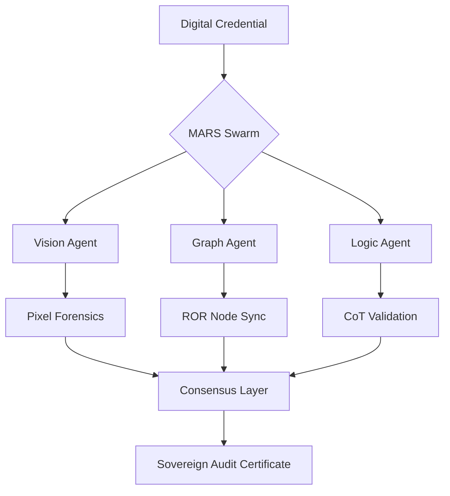

<div align="center">
  
  
  <br>

  [](https://aclas.college)

  # 🛡️ Aegis-Graph
  ### **The Sovereign Academic Audit Protocol**
  *Empowering Global Education with Agentic AI & Decentralized Graph Integrity*

  <p align="center">
    <a href="https://aclascollege.github.io/aegis-graph/"><b>Live Dashboard</b></a> •
    <a href="https://docs.aclas.college/aegis-graph"><b>Documentation</b></a> •
    <a href="WHITEPAPER.md"><b>Whitepaper</b></a> •
    <a href="https://aclas.college"><b>Atlanta College of Liberal Arts and Sciences (ACLAS) Official Site</b></a>
  </p>

  <div>
    
    
    
    
  </div>
</div>

---

## 🏛️ Executive Vision

**Aegis-Graph** is a decentralized framework specifically engineered to safeguard academic integrity in the age of generative AI. While technically governed by the **Atlanta College of Liberal Arts and Sciences (ACLAS)**, it operates as a global, sovereign protocol powered by **Agentic GraphRAG**.

> "In an era of synthetic data, truth must be sovereign." — ACLAS Sovereign Node Group.

---

## ⚠️ Current Status

The hosted dashboard is a **non-production UI demo**. It no longer issues browser-side credential approvals; professional verification requires server-side document parsing, issuer evidence, revocation checks, and a signed audit response.

---

## 🚀 Key Features

<table width="100%">
  <tr>
    <td width="50%" valign="top">
      <h4>👁️ Vision Forensics</h4>
      <p>Planned pixel-level and OCR-based analysis to detect AI-generated artifacts in digital credentials and transcripts.</p>
    </td>
    <td width="50%" valign="top">
      <h4>🗺️ Graph Navigator</h4>
      <p>Institution evidence resolution using a local index plus optional ROR lookup; ROR matches are supporting evidence, not automatic credential approval.</p>
    </td>
  </tr>
  <tr>
    <td width="50%" valign="top">
      <h4>⚖️ Logic Auditor</h4>
      <p>Evidence-weighted consistency checks for registry status, timelines, blacklist aliases, and missing credential-authenticity proof.</p>
    </td>
    <td width="50%" valign="top">
      <h4>🔒 Sovereign Ledger</h4>
      <p>Planned cryptographically signed audit trails for reproducible, tamper-evident credential review.</p>
    </td>
  </tr>
</table>

---

## 🧠 The Agentic Architecture (MARS)

Aegis-Graph operates via a collaborative **Multi-Agent Reasoning Swarm (MARS)**. Each agent handles a specific layer of the audit protocol, reaching consensus before issuing a final verdict.



---

## 📊 Performance and Evaluation

Production benchmark claims are not published yet. Current development focuses on eliminating browser-side approvals, normalizing graph evidence, and making audit decisions reproducible before publishing precision/latency metrics.

*   **Audit Precision**: pending reproducible benchmark suite
*   **Verification Latency**: pending server-side implementation
*   **Privacy Model**: local PII scrubbing prototype; ZK evidence is roadmap work
*   **Global Node Coverage**: local index plus optional ROR lookup

---

## 🌍 Global Localization (8-Language Matrix)

Our dashboard and documentation are fully localized for international adoption:
🇺🇸 EN • 🇨🇳 CN • 🇪🇸 ES • 🇫🇷 FR • 🇩🇪 DE • 🇯🇵 JP • 🇰🇷 KR • 🇵🇹 PT

---

## 🛠️ Quick Start

```bash
# Clone the Sovereign Registry
git clone https://github.com/aclascollege/aegis-graph.git

# Initialize the Multi-Agent Swarm
pip install -r requirements.txt

# Launch Local Auditor
python main_pipeline.py
```

---

Aegis-Graph is governed by the **AEGIS-GRAPH Open Governance Board**, with technical support from the **ACLAS Sovereign Research Group**. We welcome contributions from researchers, developers, and academic institutions worldwide.

- [Contributing Guidelines](CONTRIBUTING.md)
- [Code of Conduct](CODE_OF_CONDUCT.md)
- [Security Policy](SECURITY.md)

---

<div align="center">
  <p>© 2026 <a href="https://aclas.college">Atlanta College of Liberal Arts and Sciences (ACLAS)</a>. All rights reserved.</p>
  <a href="https://aclas.college">
    
  </a>
</div>
