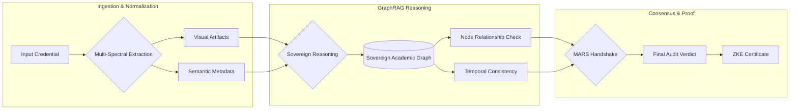

# Core Architecture

The Aegis-Graph architecture is built on the principle of **Defense-in-Depth**. It replaces traditional monolithic verification models with a **Distributed Intelligence Swarm** that operates across three specialized logic layers.

## 🏗️ System Overview

The system follows a non-linear reasoning path, where each layer provides evidence to the next until a sovereign consensus is reached.

---

## 1. The Data Ingestion Layer
At the entry point, the system performs a **Multi-Spectral Normalization**. Whether the input is a native digital PDF or a high-resolution scan, the system extracts two parallel data streams:
*   **Visual Forensic Stream**: Analyzed for compression artifacts, font weight inconsistencies, and pixel-level noise patterns typical of GAN/Diffusion generators.
*   **Semantic Metadata Stream**: Extracted text, dates, institutional names, and cryptographic signatures are passed to the reasoning engine.

## 2. The GraphRAG Reasoning Engine
Our proprietary **GraphRAG (Graph Retrieval-Augmented Generation)** engine is the core intelligence of the protocol. It performs high-dimensional traversals across the **Sovereign Academic Graph (SAG)**, which integrates:
*   **102,482 Institutional Nodes**: Real-time synchronization with ROR and institutional ledgers.
*   **Historical Timeline Metrics**: Verification of founding dates, accreditation periods, and institutional mergers.
*   **Geospatial Consistency**: Cross-referencing physical addresses with institutional claims.

## 3. The Consensus Protocol (MARS Handshake)
A final audit verdict is only issued when the **Multi-Agent Reasoning Swarm (MARS)** achieves a **Consensus Quorum**. 
*   **Logic Conflict Resolution**: If the Vision agent flags a potential forgery but the Graph agent finds a valid institutional trail, the **Logic Auditor** performs a deep-dive "Chain-of-Thought" (CoT) reasoning to resolve the contradiction.
*   **Evidence Weighting**: Each agent contributes an "Evidence Weight" (0.0 - 1.0). A total consensus score of > 0.9 is required for a **VERIFIED** status.

---
> [!NOTE]
> All architectural layers operate on a **Zero-Knowledge Evidence (ZKE)** basis, ensuring that audit metadata is verified without storing sensitive personal data.

---
*Return to [Documentation Home](README.md)*
