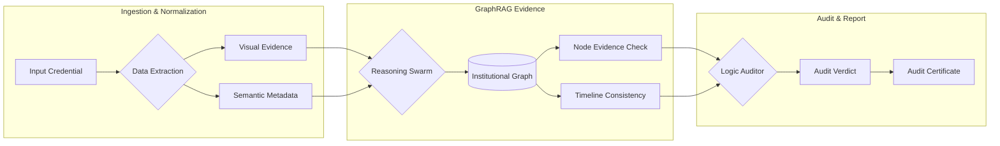

# Core Architecture

The Aegis-Graph architecture is built on the principle of **Defense-in-Depth**. It replaces traditional monolithic verification models with a **Distributed Evidence Swarm** that operates across three specialized logic layers.

## 🏗️ System Overview

The system follows a non-linear reasoning path, where each layer provides evidence to the next until an audit consensus is reached.

---

## 1. The Data Ingestion Layer
At the entry point, the system performs a **Normalization** process. Whether the input is a digital PDF or a scan, the system extracts two parallel evidence streams:
*   **Visual Evidence**: Initial structural analysis for layout consistency (Pixel-level forensics is a roadmap feature).
*   **Semantic Metadata**: Extracted text, dates, and institutional names are passed to the reasoning engine.

## 2. The GraphRAG Evidence Engine
The **GraphRAG (Graph Retrieval-Augmented Generation)** prototype is the core reasoning layer. It performs traversals across the **Institutional Graph**, which integrates:
*   **Institutional Evidence Nodes**: Local indices synchronized with registry lookups (ROR/OpenAlex).
*   **Historical Timeline Metrics**: Review of founding dates, accreditation periods, and institutional lifecycle.

## 3. The Audit Protocol
A final audit verdict is issued based on the **Multi-Agent Reasoning Swarm (MARS)** findings.
*   **Logic Conflict Resolution**: If different agents find contradictory evidence, the **Logic Auditor** performs a deep-dive "Chain-of-Thought" (CoT) reasoning to resolve the state.
*   **Evidence Weighting**: Each anomaly or supporting fact contributes to a cumulative risk score. The final verdict reflects the weighted confidence in the credential's authenticity markers.

---
> [!IMPORTANT]
> **Production Status:** Professional verification requires server-side document parsing, issuer evidence, revocation checks, and a signed audit response.

---
*Return to [Documentation Home](README.md)*
